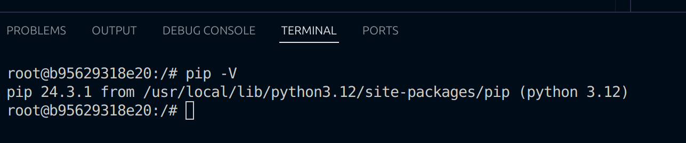

Below are the solutions to the homework for week 1.
## Question 1. Understanding docker first run
What's the version of pip in the image?

- The version of pip in the image is **24.3.1**


## Question 2. Understanding Docker networking and docker-compose
Given the content of the `docker-compose.yaml file`, pgadmin will connect with postgres with hostname **db or postgres** on port **5432**.

## Question 3. Trip Segmentation Count
During the period of October 1st 2019 (inclusive) and November 1st 2019 (exclusive), how many trips, respectively, happened:

1. Up to 1 mile: **104802**
```sql
SELECT COUNT (*) 
FROM green_taxi_data
WHERE 
    lpep_dropoff_datetime >= '2019-10-01'
AND
    lpep_dropoff_datetime < '2019-11-01'
AND
    trip_distance <= 1
   ```     
2. In between 1 (exclusive) and 3 miles (inclusive): **198924**
```sql
SELECT COUNT (*) 
FROM green_taxi_data
WHERE 
	lpep_dropoff_datetime >= '2019-10-01'
AND
	lpep_dropoff_datetime < '2019-11-01'
AND
	trip_distance > 1
AND
	trip_distance <= 3
```  
3. In between 3 (exclusive) and 7 miles (inclusive): **109603**
```sql
SELECT COUNT (*) 
FROM green_taxi_data
WHERE 
	lpep_dropoff_datetime >= '2019-10-01'
AND
	lpep_dropoff_datetime < '2019-11-01'
AND
	trip_distance > 3
AND
	trip_distance <= 7
```  
4. In between 7 (exclusive) and 10 miles (inclusive): **27678**
```sql
SELECT COUNT (*) 
FROM green_taxi_data
WHERE 
	lpep_dropoff_datetime >= '2019-10-01'
AND
	lpep_dropoff_datetime < '2019-11-01'
AND
	trip_distance > 7
AND
	trip_distance <= 10
```  
5. Over 10 miles: **35189**
```sql
SELECT COUNT (*) 
FROM green_taxi_data
WHERE 
    lpep_dropoff_datetime >= '2019-10-01'
AND
    lpep_dropoff_datetime < '2019-11-01'
AND
    trip_distance > 10
```  
## Question 4. Longest trip for each day
Which was the pick up day with the longest trip distance? Use the pick up time for your calculations: **2019-10-31**
```sql
SELECT lpep_pickup_datetime::date, 
    MAX (trip_distance) as distance
FROM green_taxi_data
GROUP BY lpep_pickup_datetime::date
ORDER BY distance DESC
LIMIT 1
```  
## Question 5. Three biggest pickup zones
Which were the top pickup locations with over 13,000 in total_amount (across all trips) for 2019-10-18? 
- East Harlem North
- East Harlem South
- Morningside Heights
```sql
SELECT ROUND(SUM(gt.total_amount)::numeric, 3) as total, lp."Zone"
FROM green_taxi_data AS gt, taxi_zone_lookup as lp
WHERE gt."PULocationID"=lp."LocationID" AND
	gt.lpep_pickup_datetime::date = '2019-10-18' 
GROUP BY lp."Zone"
ORDER BY total DESC
LIMIT 3
``` 
## Question 6. Largest tip
 For the passengers picked up in October 2019 in the zone named "East Harlem North" which was the drop off zone that had the largest tip?: **JFK Airport $87.3**
 ```sql
SELECT  MAX(gt.tip_amount) as max_tip, lp2."Zone"
FROM green_taxi_data AS gt, taxi_zone_lookup as lp1, taxi_zone_lookup as lp2
WHERE gt.lpep_pickup_datetime::date >= '2019-10-01' AND 
	gt.lpep_pickup_datetime::date <= '2019-10-31' AND
	gt."PULocationID"=lp1."LocationID" AND
	lp1."Zone"='East Harlem North' AND
	gt."DOLocationID"=lp2."LocationID"
GROUP BY 2
ORDER BY 1 DESC
LIMIT 1
``` 
## Terraform
terraform init --> terraform apply -auto-approve --> terraform destroy